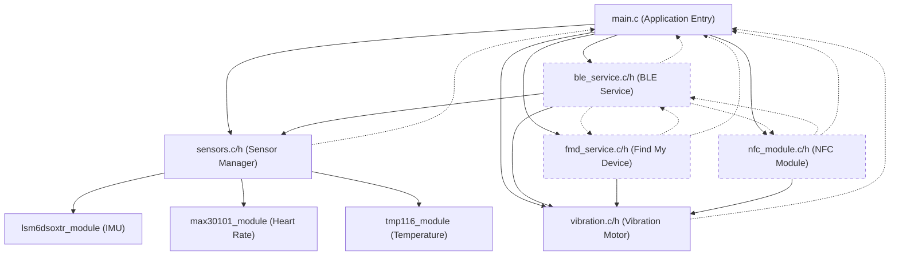

# Smart Watch Application

## Overview

This project is a firmware for a smart watch based on the nRF52840 platform, built using the Zephyr RTOS. The firmware integrates multiple sensors, Bluetooth Low Energy (BLE) services, NFC, and a vibration motor to provide a feature-rich wearable experience. The architecture is modular, making it easy to extend or adapt for additional features.

---

## Architecture Overview



---

## Main Components

### 1. Application Entry (`main.c`)
- Initializes all modules: sensors, BLE, FMD, NFC, and vibration.
- Manages the main loop and power management.

### 2. Sensors Subsystem (`sensors.c/h`)
- Manages periodic reading and aggregation of sensor data.
- Integrates:
  - **IMU**: `lsm6dsoxtr_module` (accelerometer/gyroscope)
  - **Heart Rate**: `max30101_module`
  - **Temperature**: `tmp116_module`

### 3. BLE Service (`ble_service.c/h`)
- Custom BLE GATT service for:
  - Exposing sensor data to connected devices.
  - Receiving vibration control commands.
- Handles BLE initialization and advertising.

### 4. Find My Device Service (`fmd_service.c/h`)
- Implements Google Find My Device BLE service.
- Allows remote triggering of vibration patterns for device location.

### 5. NFC Module (`nfc_module.c/h`)
- Handles NFC state, field detection, and data exchange.
- Supports payment/transaction data and triggers vibration feedback.

### 6. Vibration Motor (`vibration.c/h`)
- Provides various vibration patterns for notifications, alerts, and feedback.
- Used by BLE, FMD, and NFC modules for user feedback.

---

## File Structure

```
Smart_watch_application/
├── boards/                # Board overlays (e.g., pin mapping)
├── src/
│   ├── ble/               # BLE and Find My Device services
│   ├── nfc/               # NFC module
│   ├── notification/      # Vibration motor driver
│   ├── sensors/           # Sensor drivers (IMU, heart rate, temperature)
│   ├── main.c             # Application entry point
│   ├── sensors.c/h        # Sensor manager
├── prj.conf               # Zephyr project configuration
├── CMakeLists.txt         # Build configuration
```

---

## Build & Flash Instructions

1. **Install Zephyr SDK and Toolchain**  
   Follow the [Zephyr Getting Started Guide](https://docs.zephyrproject.org/latest/develop/getting_started/index.html).

2. **Clone this repository**
   ```sh
   git clone <repo-url>
   cd Smart_watch_application
   ```

3. **Build the firmware**
   ```sh
   west build -b nrf52840dk_nrf52840 .
   ```

4. **Flash to device**
   ```sh
   west flash
   ```

---

## Key Features

- **BLE Connectivity:** Custom GATT service for sensor data and vibration control, plus Find My Device support.
- **Sensor Integration:** IMU, heart rate, and temperature sensors managed by a unified interface.
- **NFC Support:** For payments and data exchange, with vibration feedback.
- **Vibration Feedback:** Multiple patterns for notifications, alerts, and user feedback.
- **Low Power Operation:** Designed for wearable use with efficient sleep cycles.

---

## License

Specify your license here.

---

## Credits

- Built with [Zephyr RTOS](https://zephyrproject.org/)
- Sensor and BLE stack based on Nordic Semiconductor SDKs

---

**For further customization, integration, or support, please contact the development team.** 
